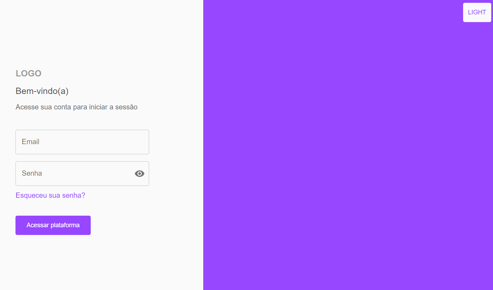

<h1 align="center"><em>Users List</em></h1>
<p align="center">This app was made to practice code organization, api calls and filter data based on simple and advanced filters.</p>

<p align="left">
 <a href="#description">Description</a> •
 <a href="#technologies">Technologies</a> • 
 <a href="#author">Author</a>
</p>

### Description

<p>Hello everyone!</p>
<p>This project is a Users List app to display information quickly and dynamic. The data comes from a mock server, and the design of the app was followed through figma.<p>
<p>It was made for practice my skills in the front-end, the idea was to make a clean and basic app, but with very good and interesting code.</p>

<p>You can see the deployment here: <a href="https://users-list-mocha.vercel.app/">Users List deploy</a></p>

</img>

### More information

For this project I follow the conventional commit pattern, to use this pattern I used commitlint, husky and commitizen to have a nice and standardized commit tree.

<p>Features</p>
[x] Light and dark color mode;
[x] Filter data by text input;
[x] Sort data by columns and order by asceding or descending;
[x] Advanced filters and combine them as you want;

<p>Challenges</p>
[x] It was my first time using Material UI for design and components in a project;
[x] The component of the advance filters and the logic to add the filters as you click in the "Adicionar filtro" button;
[x] The logic to combine the advanced filters was very challenging, I think I spent a whole afternoon just in it.

### Technologies

The following technologies were used in this project:

NextJS, Typescript, Material UI, Context Api.

This project helped me consolidate skills as theming, typed language, and design with a new lib.

### How to run the project

#### Install
You need to have the git installed in your machine to clone this repository.

Clone this repository and inside the project root directory open the terminal and run the command: 

```yarn``` ou ```npm install```

#### Run in development mode

You need to have the node installed in your machine in version 18.17 to execute this project locally.

After you installed all the dependencies you are ready to go so run the command in the terminal:

```yarn dev``` ou ```npm run dev```

After that access in your browser the local address: <a href="http://localhost:3000">http://localhost:3000</a>

#### Configuration of environment variables

Create inside the root directory of the project a file called .env, after that you have to configure the following variables:

```
# Api URL
NEXT_PUBLIC_API_URL=value
```

Replace the value of the variable for the API value.

### Author

<a href="https://github.com/victoriacesar" rel="nofollow">
 
 <br>
</a>
<p>Victória César @victoriacesar</p>
<a href="mailto:victoriacesaras@gmail.com">
  
</a><a href="https://github.com/victoriacesar">
  
<a>
